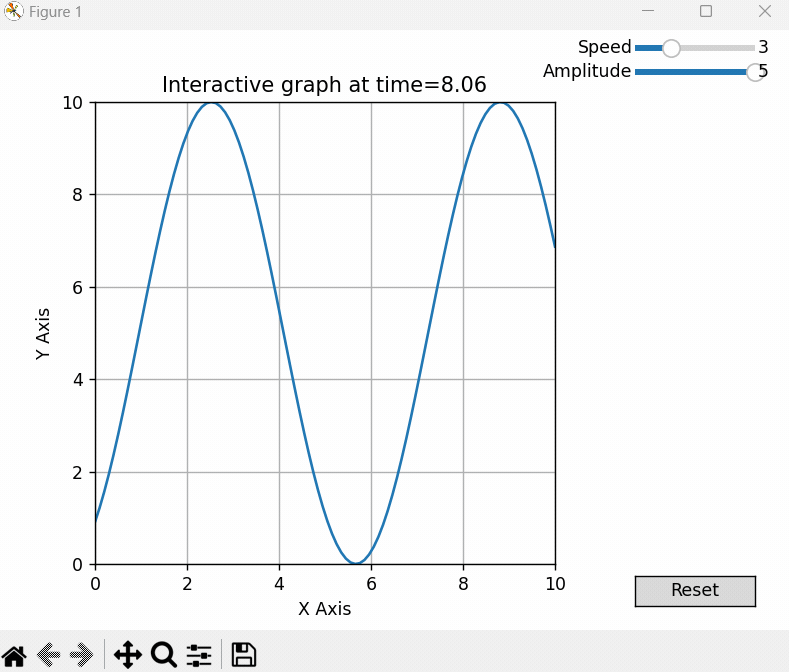

# Interactive Matplotlib

- Article [Bring Plots To Life](https://poro5.com/bringtolife)

*What you learn in this template:*

This template document contains the basic code to
have an animated matplotlib graph with sliders to control
variables and a time value passed to update function.
Highly commented and extensible.

- Learn the architecture of matplotlib Axes/subplots etc.
- Plot functions in time.
- Learn how to create UI sliders to modify variables.
- Learn how animation works in matplotlib.